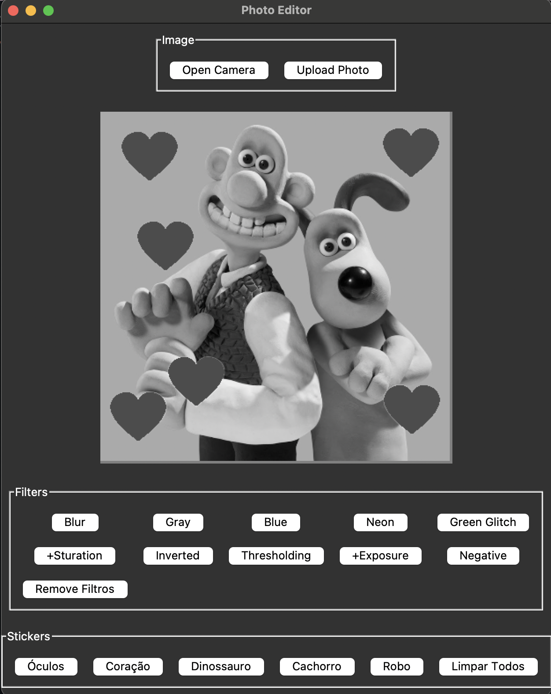

Alunos: Bel Cogo, Bruno Hoffmann e João Accorsi.

# Trabalho GB - Processamento Gráfico

## Objetivo

O objetivo do presente trabalho é criar uma aplicação capaz de obter uma imagem e aplicar filtros sobre essa imagem. Essa imagem pode tanto ser obtida através da câmera da usuária, como também importada.

## Como executar

Para executar a aplicação é necessário executar os comandos abaixo:

1. Crie um ambiente virtual na sua máquina.
```sh
python3 -m venv venv
```

2. Ative o ambiente virtual.
```sh
source venv/bin/activate
```

3. Faça o download das dependências no ambiente virtual.
```sh
pip install -r requirements.txt
```

4. Execute a classe `./src/main.py no ambiente virtual.`.
```sh
python ./src/main.py
```

## Fotos da aplicação

Demonstração após inserir foto com o filtro gray e stickers de coração:
